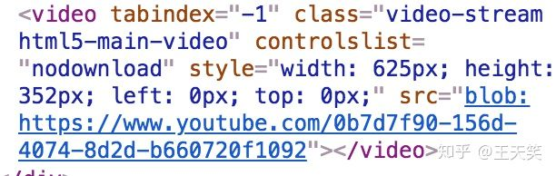
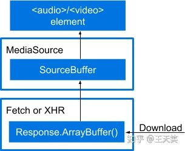

# 概念

媒体源扩展（Media Source Extensions，缩写 MSE）是一项 W3C 规范，它允许 JavaScript 为 `<audio>` 和 `<video>` 动态构造媒体源

# 为什么需要 MSE？

随着 HTML5 的普及，web 逐渐淘汰 flash 开始使用 `<audio>/<video>` 标签进行视频播放。

但在没有 MSE  标准出现之前，前端对于 video 的操作仅限于 `<video>` 标签提供的一些能力，不能对视频流进行做任何操作。

假设我们需要开发一个切换清晰度的功能，很容易就能想到动态更改 `<video>` 标签 src 的方案。

```html
<doctype html>
  <html>

  <head>
    <meta charset="UTF-8" />
    <title>Video Sample Page</title>
  </head>

  <body>
    <div id="container">
      <video
        id='video'
        controls="controls"
        width="600"
        src="./akb48.mp4"
        type='video/mp4' />
    </div>
    <div id="extras">点我切换清晰度</div>
  </body>
  <script>
    const switchButton = document.querySelector('#extras')
    const video = document.querySelector('#video')

    const handleClick = () => {
      const currentTime = video.currentTime
      const src = video.src
      video.src = src === './hd.mp4' ? './sd.mp4' : './hd.mp4'
      video.currentTime = currentTime
      video.play()
    }

    switchButton.addEventListener('click', handleClick)

  </script>
</html>
```

但这种方式有一些缺点：

- 切换 src 必然导致视频中断
- 无法做出平滑切换的效果
- 
如果我们经常使用 Youtube 这样的网站的话，会发现他们的清晰度切换是很平滑的。
​
假如 JS 能直接操作视频流，我们就可以做出平滑切换清晰度的效果。

MSE 提供了这种可能。

# MSE 是什么

> 2016年11月17日，W3C的HTML媒体扩展工作组（HTML Media Extensions Working Group）发布了媒体源扩展（Media Source Extensions™）的正式推荐标准。该规范允许通过JavaScript为 `<audio>` 和 `<video>` 动态构造媒体源，它定义了 MediaSource 对象，作为HTML 5中HTMLMediaElement的媒体数据源。MediaSource 对象可以有一个或多个 SourceBuffer 对象。应用程序可以向 SourceBuffer 对象动态添加数据片段，并可以根据系统性能及其他因素自适应调整所添加媒体数据的数据质量。来自 SourceBuffer 对象的数据可以解码为音频、视频或文本数据，并由浏览器或播放器处理。与媒体源扩展一同使用的，还是包括媒体原扩展字节流格式注册表及一组预定义的字节流格式规范。


如果你访问一些主流的视频网站时，仔细观察一下他们 video 标签会发现其中的  src 属性很奇怪。



这不是普通的 URL ，而是 Blob URL，它允许通过 Blob 对象下载二进制数据。
有了 Blob URL ，我们可以动态的往 `<video>` 标签中塞入视频二进制数据，来实现一些功能。

# MSE 流程

>You can almost think of MSE as a chain



- 通过 Range 请求拉取数据。
- 通过 MediaSource 处理数据。
- 将数据流交给 `<audio>/<video>` 标签进行播放。

# MSE 可以做什么？

- 动态清晰度切换
- 视频拼接（例如视频插入广告
- 音频语言切换
- 动态控制视频加载
- ...

# MSE 有哪些网站在使用？

> Netflix announced experimental support in June 2014 for the use of MSE playback on the Safari browser on the OS X Yosemite beta release.
> YouTube started using MSE with its HTML 5 player in September 2013.

主流视频网站均在使用，知乎也已支持，你可以在知乎开源的播放器中查看 MSE 相关的实践。

https://github.com/zhihu/griffith/

# MSE 兼容性

主流浏览器均支持，但是部分浏览器 MSE 的实现不够健壮，需要做额外的兼容。

# 参考：

https://en.wikipedia.org/wiki/Media_Source_Extensions
https://developers.google.com/web/fundamentals/media/mse/basics
https://www.w3.org/TR/media-source/
