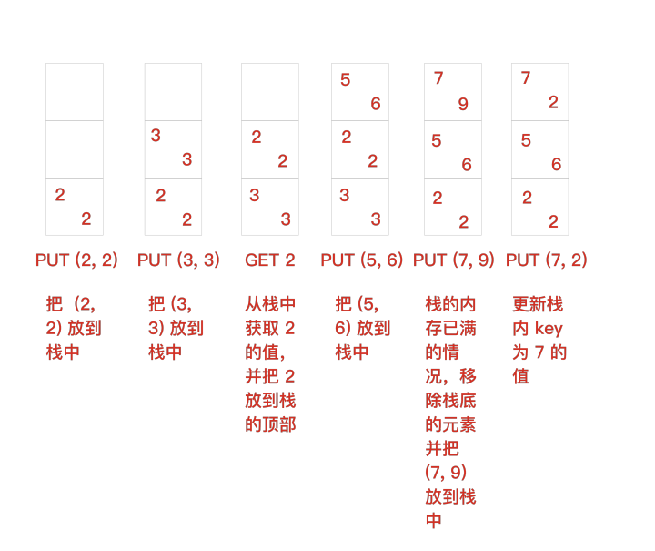

# 概念

LRU 全称是 Least Recently Used，即最近最久未使用算法，它是页面置换算法的一种。

# 原理

LRU 算法根据数据的历史访问记录来进行淘汰数据，其核心思想是「如果数据最近被访问过，那么将来被访问的几率也更高」。

我们可以通过一个有内存限制的栈来表示这个算法。

- get(key)：如果 key 在栈中，则返回对应的 value 值，否则返回 -1
- put(key)：如果 key 不在栈中，则将该 key 、value put 进栈中（注意，如果栈内存已满，则必须把最近最久未使用的元素从栈中删除）；如果 key 在栈中，则重置value的值。




# 实现

如果通过一个栈来实现，每次 get 值后都需要进行排序，会带来一些额外的时间复杂度。如果需要从 O(1) 时间复杂度内解决问题，一般会使用 Hash table + Doubly linked list 的方式。

- Hash table：O(1) 时间复杂度查找元素。
- Doubly linked list：O(1) 时间复杂度增删改元素。

## Doubly linked list（双项链表）


定义一个初始的双项链表，当需要往内存中 put 值时，把它放到双项链表 Dummy Tail 之前的位置。

put (2, 2)


put (3, 3)


如果已经超过内存限制，则需要先把 Dummy Head 之后的元素移除掉，然后再添加新的值。

put (4, 3) 前需要移除 (2, 2)


put (4, 3)


当需要从双项链表中获取对应的值时，获取之后把对应的值移到 Dummy Tail 之前的位置（使用过的数据避免先被 delete）。

get(3)


如果需要从双项链表中获取的值不存在，则不进行改动。

get(5)


如果往内存中 put 的数据已经存在，则先把该数据从双项链表中移动到 Dummy Tail 之前的位置。然后更新对应的值。

put(4, 7) 之前先把 (4, 3) 移动到 Dummy Tail 之前的位置


更新值


## Hash table（哈希表）

在每次往双项链表中 put 值时我们都需要往 Hash table 里面存储对应 key、value。
这样当我们需要查找双项链表中是否已存在对应的值。

## JavaScript 示例

```js
/**
 * @param {number} capacity
 */
var LRUCache = function(capacity) {
  this.capacity = capacity;
  this.tail = {};
  this.head = {};
  this.tail.prev = this.head;
  this.head.next = this.tail;
  this.map = new Map();
};

 /**
 * @param {number} key
 * @return {number}
 */
LRUCache.prototype.get = function(key) {
  if (this.map.has(key)) {
    const node = this.map.get(key);

    node.prev.next = node.next;
    node.next.prev = node.prev;

     this.tail.prev.next = node;
    node.prev = this.tail.prev;
    node.next = this.tail;
    this.tail.prev = node;

     return node.value;
  } else {
    return -1;
  }
};

 /**
 * @param {number} key
 * @param {number} value
 * @return {void}
 */
LRUCache.prototype.put = function(key, value) {
  if (this.get(key) !== -1) {
    this.tail.prev.value = value;
  } else {
    // capacity 限制
    if (this.capacity === this.map.size) {
      this.map.delete(this.head.next.key);
      this.head.next = this.head.next.next;
      this.head.next.prev = this.head;
    }

     const newNode = { key, value };
    this.map.set(key, newNode);

     this.tail.prev.next = newNode;
    newNode.prev = this.tail.prev;
    newNode.next = this.tail;
    this.tail.prev = newNode;
  }
};

 /**
 * Your LRUCache object will be instantiated and called as such:
 * var obj = new LRUCache(capacity)
 * var param_1 = obj.get(key)
 * obj.put(key,value)
 */
```

# 应用

缓存

# 参考

https://en.wikipedia.org/wiki/Cache_replacement_policies 
https://www.youtube.com/watch?v=S6IfqDXWa10&t=586s
