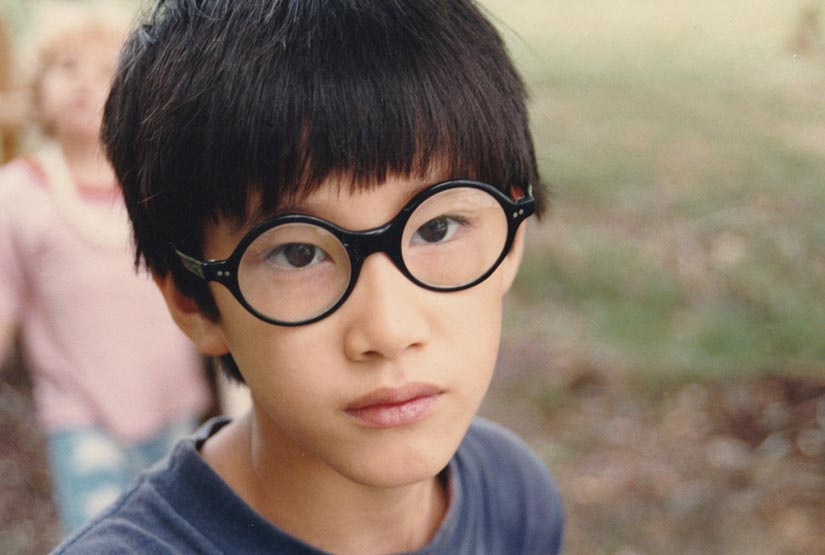

> 原文：[A SON SPEAKS OUT By Moses Farrow](http://mosesfarrow.blogspot.com/2018/05/a-son-speaks-out-by-moses-farrow.html)
> 
> 备注：本文为 Mosez Farrow 2018 年对伍迪·艾伦性侵事件的回应

我是个非常注重隐私且对公众的注意力不感兴趣的人。但是，鉴于一些对于我的父亲伍迪·艾伦令人难以置信的报道和不准确的攻击，我觉得我不能再保持沉默了，他一直在为自己未犯下的罪行而受到谴责。

在所谓的事情发生之前、之中、之后，我都在场。到了现在，今年早些时候公众的一些歇斯底里的情绪已经有些平息，我对真相能得到公平的审理抱有了一些希望，我想要分享一些我的故事。

*********************

1992 年 8 月 4 日的康涅狄格州桥水镇是一个温暖和阳光明媚的日子，但是在我们的 Frog Hollow 别墅内，空气中却弥漫着一丝寒意。我的母亲米亚·法罗和他的儿时好友 Casey Pascal 外出购物。我当时 14 岁，和我 7 岁的小妹妹 Dylan、4岁的弟弟 Satchel（现在已经改名为 Ronan）、Casey 的三个孩子在家。我们的保姆 Kristi、Casey 的保姆 Alison 和我们的法国老师 Sophie 一期在家看护我们，房间里到处都是人。

那天伍迪·艾伦坐在电视房地板上看「谁陷害了兔子罗杰」，表面上来看，和他之前来我们家没什么区别。但是我的妈妈在他来之前已经提醒了我们不要让伍迪·艾伦离开我们的视线。她的愤怒是可以理解的，七个月前她在伍迪的公寓里发现了宋宜的照片，从而发现了伍迪和我 21 岁的姐姐之间的亲密关系。「伍迪是一个恶魔、怪物、魔鬼，宋宜是我们的死敌」，几个月以来，她的这些话一直像咒语一样钻进我们的脑袋。不管伍迪是不是在身边，她都一直在重复这些话（Satchel 才刚 4 岁，但是因为她的行为，导致 Satchel 竟然告诉我们的保姆「我的姐姐和我的父亲在做爱」）。我的母亲是我们关于伍迪唯一的信息来源，她非常有说服力。

在那个夏天，作为家里最大的孩子，我对米亚的警告非常重视。我认为我的工作就是支持我的母亲，我和其他得孩子都迫切的需要她的认可。我知道违背她的意愿会带来恐怖的后果。我会一直盯着伍迪知道她回家。但是，暗地里，我又有一些纠结。

为了解释我纠结的原因，我想要给你们一些关于我家庭的背景信息。

直到现在，伍迪和米亚都没有结婚，而且他从来不喝我们住在一起，甚至都不会在我们的公寓过夜。他经常早上 6:30 带着两份报纸和一堆松饼过来。我会比其他的孩子先起床，所以我们俩会在厨房的餐桌上一起吃早饭。他看纽约时报，我看华盛顿邮报里面的漫画和填字游戏。我们会在 Dylan 醒之前度过一段平静的时光。当 Dylan 醒之后，他会给 Dylan 做一份带肉桂或者蜂蜜的吐司然后陪着她吃早餐，他看起来不像是个「怪物」。

我的哥哥姐姐都是米亚和她的前夫 André Previn 生育或者领养的孩子。在 1985 年，米亚领养了 Dylan。两年后她和伍迪有了自己的亲生儿子 Satchel。49 岁的伍迪似乎也在享受着当父亲的乐趣。

1980 年米亚领养了我，我成了她第七个孩子。1992 年，她向收养机构写了信，信中描述伍迪是一个非常棒的父亲。最终成功地让伍迪成为了我和 Dylan 的共同领养人。虽然伍迪早已在我的生活中充当了父亲的角色，但是当他正式成为我的父亲后，我还是非常激动。我们一起玩国际象棋、一起钓鱼、一起打球。这些年来，Satchel、Daylan 和我经常去他的片场和剪辑室参观，晚上，他会来米亚的公寓和我们共度一些时光，我从来没有看到过他有过任何不恰当的行为。

当然，新闻上伍迪和宋宜的关系公开了，然后一切都变了。我的母亲坚定的把伍迪和宋宜从我们的生活中移除，我们没有任何选择，只能接受她的决定。

就算有人怀疑 Dylan 的指控，也常常因为伍迪和宋宜的关系而作为怀疑他的理由。一些陌生人用一些错误的信息对宋宜的攻击让我震惊。她不是伍迪的女儿（没有领养，不是继女，也没有任何父女关系），也没有发育障碍（她在哥伦毕业大学获得了特殊教育硕士学位），而且关于她在未成年时就开始和伍迪约会的说法是完全错误的。

事实上，伍迪几乎没有和童年时的宋宜说过话。在宋宜 20 岁时，是我的目前母亲先建议伍迪去花时间接触宋宜。伍迪同意之后开始带宋宜去看尼克斯的球赛。这就是他们情感的开始。是的，这个关系非常不正统且别扭，它也破坏了我们的家庭且对我的母亲造成了很大的伤害。但是这段关系本身对我们家庭的伤害远没有我的母亲之后的行为大，从那时候开始，她坚持把这段背叛当做我们所有的生活的重心。

但是我的童年创伤和伍迪完全无关。这段创伤从伍迪开始介入我们的生活之前就开始了，它来自于家庭深处一以贯之的黑暗面。

我的祖父 John Farrow 是好莱坞有名的酒鬼和渣男，在我祖父的家庭中有无数次因为酗酒引发的争吵。年轻的时候，我的舅舅 John 经常来看完我们，但是米娅曾经告诉我，她差点被 John 性侵。目前我的舅舅 John 因为多想猥亵儿童指控而被关在监狱（我的妈妈从来没有对此发表过公开的表态，也没有对受害者有任何声援）。我的舅舅 Patrick 和他的家人也经常来我家做客，但是这些随着米娅和 Patrick 的争吵不断增加，Patrick 已经很久没有来过我家了。2009 年，我的舅舅 Patrick 自杀了。

我的妈妈也有自己的黑暗面，她在 21 岁时嫁给了 50 岁的 Frak Sinatra。当他们离婚后，我的母亲搬到了她的好朋友 Dory Previn 那里。我的母亲和 Dory Previn 的丈夫 André 发生了婚外情，并坏了他的孩子。Dory 和 André 的婚姻破裂了，Dory 还被送进了精神病院。这些事情从来没有被提起过，我也是近几年才知道这件事。但是，从我的视角来看，作为一个有从业执照的心理治疗师，很容易能看出来这种不正常的种子已经在我家生根发芽。

对于我的母亲来说，向全世界展示一个由亲生孩子和领养孩子组成的幸福家庭是非常重要的。我相信我的母亲从生活条件不好的地方收养残疾的儿童是出自好意，但是在我家庭内发生的现实让我意识到事实并不是如此。当回忆起我的兄弟姐妹（有些是盲人或者身体有残疾）被拖下楼梯扔进被锁上门的卧室或者衣柜，我感到非常痛苦。她甚至因为一些非常小的过失，把因小儿麻痹症而瘫痪的弟弟 Thaddeus 关在外边的小屋一整夜。

宋宜是她最常找的替罪羊。我的姐姐有独立的倾向，在我们所有兄弟姐妹中她是最不怕米娅的。如果被逼急了，她会把我的妈妈米娅的行为大声说出来，随之而来的就是她们的争吵。在宋宜小时候，米娅有一次把一个大的瓷器扔到了她的头上，幸运的是，瓷器没有砸中宋宜，但是瓷器的碎片打在了宋宜腿上。几年后，米娅还用过电话听筒打过宋宜。宋宜明确表示她只想要一个人静静的呆着。即使在后来她和伍迪发展了一段不正常的关系，但这也同样让她有了逃离这个家的机会。其他人则没有那么幸运了。

很多媒体都声称我的姐姐 Tam 在 21 岁是死于心力衰竭。事实上，Tam 一生都在和抑郁症作斗争。我的母亲拒绝给 Tam 提供帮助，并坚持认为 Tam 只是「喜怒无常」。2000 年的一个下午，在与米娅的最后一次争吵后，我的母亲离家出走，而 Tam 则服药过量自杀。我的母亲告诉其他人 Tam 因为是一个盲人，不知道自己拿的是哪个药片才导致服药过量去世。但是 Tam 记忆力非常好，对空间感知力也很强，而且眼睛看不到又不影响她的数自己吃了多少个药片。

Tam 服药过量的细节和她与米娅的斗争都是我的哥哥 Thaddeus 直接告诉我的，他是第一手的证人。遗憾的是，他已经无法证实这个说法了，就在两年前（2016）,Thaddeus 在离我的母亲家 10 分钟路程的地方，在车里开枪自杀了。

我的姐姐 Lark 是另一个死者。她走上了自我毁灭的道路，已毒瘾作斗争，并最终在 2008 年 35 岁时死于艾滋病。

对于我们所有人来说，如果你不能完全按照母亲吩咐的去做（无论要求多么过分），那你几乎不可能在她的屋檐下生活。

在一年级和二年级之间的夏天，我的母亲准备在我的卧室贴新的墙纸。这座房子位于 Connecticut 州，我的卧室和她的卧室是对门。当我的母亲走到我的床前并找到了一把卷尺时，我正要睡觉。她露出咄咄逼人的眼神并问我是不是拿了卷尺。我站在她面前愣住了，她一遍又一遍问，为什么找了一整天最后卷尺会出现在我的床上。我告诉她我不知道，也许是某个工人把它放在这了。

当我没有给出她想要的答案时，她扇了我一巴掌，并把我的眼镜打到了地上。她告诉我我在说谎，我一直在哭，我听到她解释说会排练今天发生的事情。她会走到房间，然后我会告诉她我非常抱歉拿了卷尺去玩，我再也不会这么做了。她至少让我排练了六次，并且指使我告诉兄弟姐妹我拿了卷尺（按照排练的方式）。

这是她洗脑的开始。我开始变得焦虑与恐惧。有一次，当我有了一条新的牛仔裤时，我觉得如果剪掉几个腰带环会非常酷。当米娅看到我的牛仔裤时，她不断的打我的屁股，并让我脱掉所有的衣服，她对我说「你不配穿任何衣服」，而且让我当着刚和 André 吃完晚饭的兄弟姐妹的面裸体站在房间的角落。（2014 年，但我向「People」杂志讲述我遭受的经历后，Dalan 称这是一种背叛并告诉我「我再她心里已经死了」。她后来公开反对我对童年的回忆，并声称「我的回忆无关紧要」，很难想象这是一个自称「为虐待守护者辩代言」的女人说的。）

反击不是一个可行的选择。在某个夏天，米娅指责我在离开电视房时关了窗帘。事实上，因为Dylan 和 Satchel 在房间看电影，窗帘在前一天就被拉上了。她坚持认为是我把窗帘拉上的。她的朋友 Casey 刚好来我家，当她们在厨房忙碌时，我母亲还在指责是我关了窗帘。在那一瞬间，我再也受不了了，并大声叫喊「你在撒谎」，米娅蹬了我一眼然后把我带进了电视房旁边的卫生间。在卫生间，她不由分说的打我的身体，扇我耳光，把我往后推，打我胸口并大声叫到「你竟然在我的朋友面前说我撒谎，谁给你的胆子？你才是一个不讲道理的骗子」。我从身体和精神上都被打败了。米娅剥夺了我的声音和自我意识。很明显，只要我稍微走出她洗脑的范畴，她都不会容忍。这样的经历，让我让我对她忠顺，又深深的恐惧。

总之，这不是一个幸福或者健康的家庭。还是让我们回到 1992 年 8 月 4 号吧。

Twitter 上的陌生人经常对我提出这样的问题：「你有没有亲眼目睹性侵事件，你怎么知道它没有发生？」，但如果没有发生过，又怎么会有人目睹性侵呢？

作为那一天的「男主人」，我曾经答应米娅要留意任何麻烦，我也一直在这样做。我记得伍迪坐在电视房里，而且我也能大概知道 Dylan 和 Satchel 在哪。并不是说每一个人都呆在同一个地方，但我会刻意刘亦每个人的举动。我确实有印象伍迪曾经离开过房间，但并不是和 Dylan 在一起。他会走进其他的房间打电话、读报纸、上厕所或者去池塘边散步透透气。

除了五个孩子，家里还有三个成年人在房间里。这些人在这几个人一直被告知伍迪是一个怪物。没有人会允许 Dylan 和伍迪一起，就算他想也不可能实现。Casey 的保姆 Alison 后来声称当她走进电视房，看到了伍迪跪在地板上把头埋进 Dylan 的双腿中间。真的吗？在我们所有人面前干这个事？如果她真的目睹了这一切，为何不马上告诉我们的保姆 Kristi（我还记得一些讨论说这个行为是发生在楼上米娅的房间。但同样，假设最开始伍迪就带着 Dylan 走掉了，事情发生在楼上房间，也是会被进入客厅的任何人看到的）。唯一能让人私下做出性侵行为的地方是我母亲卧室外的一个小阁楼，所以，叙事改变了，阁楼成了新的「现场」。

2014 年在《纽约时报》上广为流传的公开信中，成年的 Dylan 突然想起了被性侵的每个细节。她写道，「他让我躺在床上，玩我哥哥的电动火车玩具，然后他对我进行了性侵犯，他边做边和我说话，轻声的告诉我我是一个好女孩，这是我和他之间的秘密，并承诺以后带我去巴黎，我会成为他电影里的明星。我的注意力集中在了玩具火车上，看着它一圈又一圈的行驶。直到现在，我都不太能看玩具火车」。

这是一个精确而令人信服的描述，但这有一个很大的问题：那个阁楼并没有电动火车玩具。事实上，即便是我们这些还在想，也没办法去上面玩玩具火车。这是一个未装修完只能爬行的空间，在陡峭且倾斜的屋顶下，有钉子、玻璃、捕鼠器、粪便、樟脑丸、塞满了衣服的箱子和我母亲的旧衣柜。

在阁楼的空间里容纳一套能动的电动火车玩具，这个想法确实太可笑了。我的一个哥哥确实有一套精美的火车模型，但是它摆在由一楼车库改造的男孩房间。（也许这个火车玩具就是我妹妹记忆中的火车？）。现在，每当我听到 Dylan 公开声明她在 7 岁那年发生的事情时，我脑子里只有那套想象中的玩具火车。而且她在最初的调查和听证会上从来没有提起过火车的事情。难道是某个人建议成年的 Dylan，如果提供一些特殊的细节可以让她的故事变得更真实？或者她真的相信她记得火车玩具「一圈又一圈」？就像她说她记得伍迪承诺带她去巴黎并让她成为电影明星（有点奇怪，对于 7 岁的孩子不应该提供新玩具或者洋娃娃嘛？）？而且这一切都发生在一群答应要盯着伍迪的人都在楼下的时候，我们会忽略楼上的事情吗？

最后，我妈妈和 Casey 带着新领养的孩子 Tam 和 Isaiah 回来了。保姆们并没有任何抱怨，Dylan 的行为也没有任何异常。事实上，伍迪和米娅当天晚上还出去吃了饭。晚饭后，他们回到了 Frog Hollow，伍迪在楼下的卧室过夜，显然，伍迪没有任何异常行为，大人们也没有任何负面的报告。

第二天早上，伍迪还在家里。在他离开之前，我短暂的去了一趟客厅，目睹了 Dylan 和 Satchel 和他在一个巨型画的窗户前坐在一起。孩子们拿着玩具店的目录，正在标记着他们希望伍迪下次来时要带来的玩具。那是一种欢快有趣的气氛，如果米娅的指控成立，前后两天的气氛实在有些冲突。多年之后，我曾经向伍迪提起过我的回忆，他对我说，他也记得当时的气氛多么的美好。他还告诉 Satchel 和 Dylan 只能各自标记一两个玩具，但他们几乎笑着把所有的玩具都标记了。他还记得他把那个目录带回了 New York，他告诉我，他最后把那本目录珍藏了好多年。他也没有想到竟然从那之后再也见不到自己的女儿了。

有趣的是，在伍迪回到 New York 之后，米娅才接到一通电话，这通电话永远的改变了我们的生活。电话是她的朋友 Casey 打来的，她告诉米娅她的保姆 Alison 亲眼看到了伍迪在电视房把头埋进了 Dylan 两腿之间。

当我们的长期保姆 Monica 第二天回来工作时，我对她说，我认为这个故事是编的。和我们一起生活了 6 年的 Monica 几个月后就辞职了，她说米娅正在向她施压，让她站在自己这边指控伍迪。

后来 Monica 出来作证说她看到米娅录下了 Dylan 描述伍迪是如何摸她的过程。她说米娅花了两到三天时间去录像。她在证词中说：「我记得法罗女士当时对 Dylan 说，”Dylan，爸爸对你做了什么？Dylan，爸爸接下来对你做了什么？“Dylan 似乎并不感兴趣，法罗女士会停止录像一会，然后继续」。我可以证实这一点，我自己也见证了这一过程。Dylan 的另一个治疗师 Nancy Schultz 博士批评录视频的行为并质疑了内容的合法性，后来她也被立即开除了（我的母亲，对她来说，忠诚非常重要，她还开出了另一个长期的保姆 Mavis，她认为 Mavis 发表了对她不利的言论）。

在监护权的听证会上，我的母亲一直强调一家人要团结在一起。害怕被打的我，也开始参与进来。我甚至写了一份信来谴责伍迪，说他做了一些可怕的、不可饶恕的事情。而且毁灭了我的梦想。我甚至在聚集在我们路边的新闻媒体面前公开的读了这封谴责信，我知道这会得到我母亲的认可。那次我对父亲的公开谴责，直到现在仍是我这辈子最大的遗憾。

那一年晚些时候，我记得我去 New Jersey 参加了许多次律师的会议和一次评估。我天生就很害羞并且一直保持沉默。直到我终于觉得有必要说出来之后，我告诉评估人员，我感觉我被夹在父亲和母亲之间。之后，我回到了学校，然后我的母亲打电话过来，尖叫着说：「你知道你做了什么嘛？你毁了我的指控！你需要打电话给律师并且告诉她你收回自己说的话，告诉她你希望他们把你说的话从记录里删除掉。」。我感觉一阵胃痛，当我下一次和律师见证时，我重复了她的话：「我收回我说过的话，我收回我的陈述，并希望能沟通记录中删除」。这样的事情再一次发生了，我被迫按照我目前的剧本来证明我的忠诚。

尽管她还在给我们讲「一家人要团结在一起」，但在高中二年级，我的母亲还是违背我的意愿把我送到了 Connecticut 州的寄宿学校。我反对她的提议，并希望能够呆在 New York；她根本不在意。我在这出家庭肥皂剧中的作用已经完成。我发表了反对自己父亲的声明，我的角色已经落幕，我被抛弃了。

在那时，我并不知道 Connecticut 州警方委托 Yale/New Haven Hospital 的 Child Sexual Abuse Clinic 进行的为期半年的刑事调查。但自从几年前这一性侵指控被再一次提起来后，我看了那一份调查报告。它得出的一个结论是：「Dylan 并没有被伍迪先生性侵，她的陈述有一种被排练的感觉，可能是受她母亲的教导或者影响」。这些结论和我自己的童年经历完全吻合：教导、影响和排练这三个词正好概括了我母亲的试图养育我们的方式。我知道 Dylan 最近把这种洗脑理论成为我父亲的 ”spin“，但这不是这样的。这个结论不仅仅是州政府委托进行调查得出的结论，也是我们家生活的方式。

这份报告让对我父亲提出的刑事指控被终结。New York 州社会服务局进行了 14 个月的二次调查，得出和 Yale/New Haven 同样的结论：「没有任何可信的证据表明 Dylan Farrow 收到过虐待或者性侵」。尽管如此，当法官把 Satchel 和 Dylan 的监护权判给米娅时，15 岁的我还是选择了阻力最小的方式，留在我的母亲身边。

二十多岁时，我硕士毕业后不就，我和米娅沟通说我想要联系伍迪。我永远不会忘记，她的回信告诉我说支持我去联系，并理解我对父亲这个形象的需求时，我多么开心。这个幸福太短暂了，不到 24 小时，她重新考虑并回了新的一封信，告诉我禁止我与「那个怪物」联系。

几年后，我和母亲变得越来越疏远，但是经过多年的自我反省，专业帮助和我爱的人/爱我的人的支持。我才体会到我童年悲剧的真相，以及我的母亲对我和我的兄弟姐妹所做的一切。我很庆幸我清醒了，知道了发生在我身上的真相，但对于需要花费那么久的时间才能清醒，其感到非常失望。

与此同时，我的父亲尺寸面对我母亲和她的代理人一波又一波不公平且持续的攻击，质疑他为什么这些年为什么一直没有被「绳之於法」。但是伍迪并不是没有绳之於法，恰恰相反，他是在米娅的指控被两个独立机构全面调查后被告知「清白」。在性侵指控不被认可后，米娅走到了法律的尽头。但媒体的审判不需要事实，而 Twitter 既不需要真相也不需要约束就可以无来由的对一个人指控。

对于那些对于我父亲罪行深信不疑的人，我请求你考虑一下：在这个 #MeToo 的时代，当需要电影界的重量级人物面临几十项指控的时候，我父亲只被指控过一次错误的行为，还是被一个曾经一起争夺多监护权的前伴侣指控的。在近 60 年的公众视线中，没有一个人站出来指控他，甚至没有人说过他会在约会/工作中有不合时宜的行为，更别说调戏儿童了。作为一个经过专业训练的人，我知道儿童性侵是一个强迫症/偏执症，一般都会反复施行。Dylan 这么多年来多次和伍迪在他的公寓单独相处，没有任何不合时宜的行为，然而现在有人相信，在伍迪 56 岁时，他突然决定在一个充满敌意的房间里变成一个猥亵儿童的人。

致那些曾与我父亲合作过并发生谴责他的演员：「你们急于加入谴责的浪潮中，因为你们害怕不站在社会运动中正确的一方，但是，与其接受 Twitter 暴民歇斯底里、盲目重复 25 年被调查否认的故事，不如考虑一下我说的话，毕竟，我当时在那个屋子里，而且我比你们更了解我的父亲和母亲，也更有资格」。

致我的妹妹 Dylan：「和你一样，我相信说出来的力量。我已经打破沉默，说出了我们母亲虐待我们的真相。我在离开她之后才，伤口才慢慢愈合。而她对你所做的一些事无法忍受的。我希望你能平静下来好好想想，把你的生命投入到帮助母亲毁掉父亲名誉上，不可能给你带来任何任何好的结局」

最后，对我的母亲：「你总是说你很欣赏我的一件事就是我倾听的能力。我挺你说了那么多年，把你的话看的别任何人都要重。你又一次对我说，和愤怒为伍是不健康的。然后，26 年后的今天。我猜你下一步就是发起一场运动来诋毁我的言论，我知道这是我的责任，而且我也愿意承担这个责任」。

「但是，经过这么长时间，是时候结束了。你和我都知道真相。是时候结束这场报复了」
